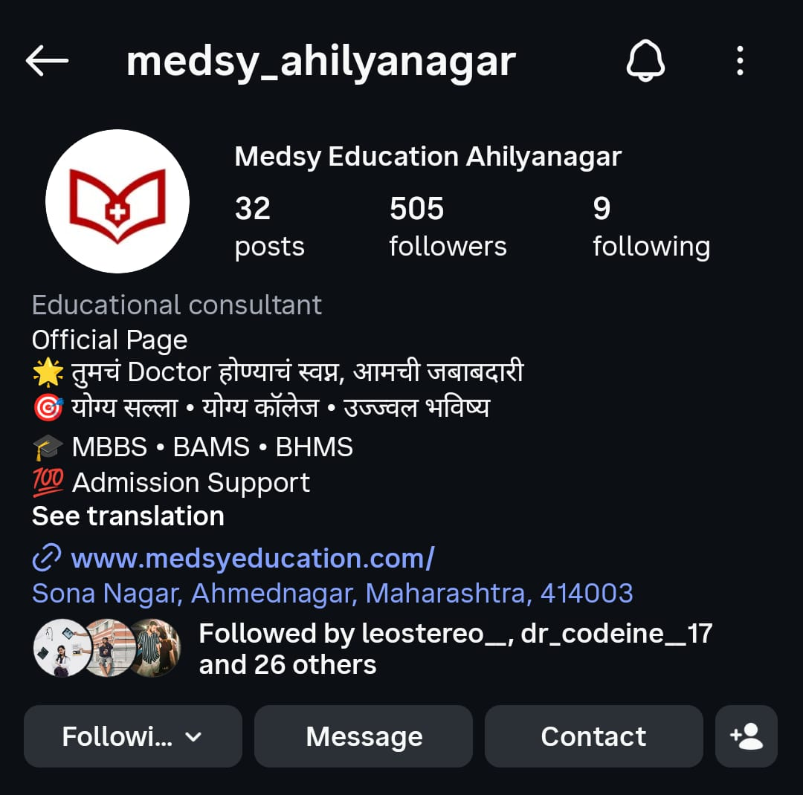

<head>
    <meta charset="UTF-8">
    <meta name="viewport" content="width=device-width, initial-scale=1.0">
    <meta name="theme-color" content="#0f172a">
    <title>Prasad Shejole · Portfolio</title><!-- Font Awesome -->
<link rel="stylesheet" href="https://cdnjs.cloudflare.com/ajax/libs/font-awesome/6.5.0/css/all.min.css">

<!-- PDF Generator -->

</head><body>
<!-- =====================================================
     HEADER
====================================================== -->

<header class="site-header">

    <a href="#" class="site-logo" onclick="switchPage('home'); return false;">

        

            <i class="fas fa-user-graduate"></i>
        

        

            <h1>Prasad Shejole</h1>
            Personal Portfolio
        

    </a>

    <nav class="site-nav">

        

            <button class="nav-tab active"
                    data-page="home"
                    onclick="switchPage('home')">
                <i class="fas fa-home"></i>
                Home
            </button>

            <button class="nav-tab"
                    data-page="about"
                    onclick="switchPage('about')">
                <i class="fas fa-user"></i>
                About
            </button>

            <button class="nav-tab"
                    data-page="skills"
                    onclick="switchPage('skills')">
                <i class="fas fa-code"></i>
                Skills
            </button>

            <button class="nav-tab"
                    data-page="projects"
                    onclick="switchPage('projects')">
                <i class="fas fa-images"></i>
                Projects
            </button>

            <button class="nav-tab"
                    data-page="contact"
                    onclick="switchPage('contact')">
                <i class="fas fa-envelope"></i>
                Contact
            </button>

        

        <button class="theme-toggle"
                id="themeToggle"
                onclick="toggleTheme()"
                aria-label="Toggle dark mode">
            <i class="fas fa-moon"></i>
        </button>

    </nav>

</header>

<!-- =====================================================
     PAGE CONTENT
====================================================== -->

<main class="page-content">

    <!-- ================= HOME ================= -->

    <section class="page active" id="page-home">

        

            

                

                    

                        
                    

                    <h2>Prasad Shejole</h2>

                    

                        <i class="fas fa-graduation-cap"></i>
                        MBBS Student · 4th Year
                    

                    

                        A dedicated 4th-year MBBS student with a passion for
                        digital media, content creation, and strategic
                        communication. Bridging the gap between medicine
                        and modern media.
                    

                    <button class="download-btn-home" id="downloadBtn">
                        <i class="fas fa-file-pdf"></i>
                        Download CV (PDF)
                    </button>

                

                

                    

                        0
                        MBBS Year
                    

                    

                        0
                        Projects
                    

                    

                        0
                        Events Managed
                    

                    

                        0
                        Videos Edited
                    

                

            

            

                

                    <h3 class="section-title">
                        <i class="fas fa-bullhorn"></i>
                        Social Media Marketing
                    </h3>

                    

                        

                            
                                <i class="fab fa-instagram"></i>
                                Instagram Strategy
                            

                            
                                <i class="fab fa-linkedin"></i>
                                LinkedIn Branding
                            

                            
                                <i class="fas fa-chart-line"></i>
                                Analytics & Insights
                            

                            
                                <i class="fas fa-ad"></i>
                                Meta Ads
                            

                            
                                <i class="fas fa-people-arrows"></i>
                                Community Engagement
                            

                        

                    

                

                

                    <h3 class="section-title">
                        <i class="fas fa-pen-fancy"></i>
                        Editing & Content Creation
                    </h3>

                    

                        

                            
                                <i class="fas fa-video"></i>
                                CapCut Pro
                            

                            
                                <i class="fas fa-paint-brush"></i>
                                Canva Expert
                            

                            
                                <i class="fas fa-cut"></i>
                                Video Editing
                            

                            
                                <i class="fas fa-image"></i>
                                Thumbnail Design
                            

                            
                                <i class="fas fa-film"></i>
                                Reels / Shorts
                            

                        

                    

                

                

                    <h3 class="section-title">
                        <i class="fas fa-calendar-check"></i>
                        Event Management
                    </h3>

                    

                        

                            
                                <i class="fas fa-tasks"></i>
                                Planning & Logistics
                            

                            
                                <i class="fas fa-users"></i>
                                Team Coordination
                            

                            
                                <i class="fas fa-handshake"></i>
                                Vendor Management
                            

                            
                                <i class="fas fa-trophy"></i>
                                Medical Conferences
                            

                            
                                <i class="fas fa-microphone"></i>
                                Hosting / Emcee
                            

                        

                    

                

            

        

    </section>

    <!-- ================= ABOUT ================= -->

    <section class="page" id="page-about">

        

            

                <h2>About Me</h2>

                

                    A dedicated 4th-year MBBS student currently pursuing
                    medical education in Russia, with a strong passion for
                    digital media, content creation, and strategic
                    communication. While my academic journey focuses on
                    healthcare, I actively cultivate expertise in social
                    media marketing, video editing, graphic design, and
                    event management. This portfolio highlights my creative
                    endeavors and professional skills beyond the clinical
                    realm, showcasing a well-rounded individual capable of
                    bridging the gap between medicine and modern media.
                

            

            <h3 class="section-title">
                <i class="fas fa-university"></i>
                Education
            </h3>

            

                

                    MBBS
                    2023 – 2029
                    
                        Pursuing medical education in Russia
                    
                

                

                    Pre-medical
                    2020 – 2022
                    
                        Foundation in medical sciences
                    
                

                

                    Digital Marketing
                    Certification
                    
                        Specialized in social media strategy and content creation
                    
                

            

        

    </section>

    <!-- ================= SKILLS ================= -->

    <section class="page" id="page-skills">

        

            <h3 class="section-title">
                <i class="fas fa-code"></i>
                Skills & Expertise
            </h3>

            

                <!-- Social Media -->

                

                    <h4>
                        <i class="fas fa-bullhorn"></i>
                        Social Media Marketing
                    </h4>

                    

                        

                            Instagram Strategy
                            90%
                        

                        

                            

                        

                    

                    

                        

                            LinkedIn Branding
                            85%
                        

                        

                            

                        

                    

                    

                        

                            Analytics & Insights
                            75%
                        

                        

                            

                        

                    

                    

                        

                            Community Engagement
                            80%
                        

                        

                            

                        

                    

                

                <!-- Editing -->

                

                    <h4>
                        <i class="fas fa-pen-fancy"></i>
                        Editing & Content Creation
                    </h4>

                    

                        

                            CapCut (Pro)
                            90%
                        

                        

                            

                        

                    

                    

                        

                            Canva (Expert)
                            90%
                        

                        

                            

                        

                    

                    

                        

                            Video Editing
                            85%
                        

                        

                            

                        

                    

                    

                        

                            Thumbnail Design
                            88%
                        

                        

                            

                        

                    

                

                <!-- Event Management -->

                

                    <h4>
                        <i class="fas fa-calendar-check"></i>
                        Event Management
                    </h4>

                    

                        

                            Planning & Logistics
                            85%
                        

                        

                            

                        

                    

                    

                        

                            Team Coordination
                            82%
                        

                        

                            

                        

                    

                    

                        

                            Timeline Execution
                            78%
                        

                        

                            

                        

                    

                    

                        

                            Hosting / Emcee
                            80%
                        

                        

                            

                        

                    

                

                <!-- Additional -->

                

                    <h4>
                        <i class="fas fa-tools"></i>
                        Additional Skills
                    </h4>

                    

                        

                            Content Strategy
                            82%
                        

                        

                            

                        

                    

                    

                        

                            Brand Identity
                            75%
                        

                        

                            

                        

                    

                    

                        

                            Social Media Ads
                            70%
                        

                        

                            

                        

                    

                    

                        

                            Photography
                            85%
                        

                        

                            

                        

                    

                

            

        

    </section>

    <!-- ================= PROJECTS ================= -->

    <section class="page" id="page-projects">

        

            <h3 class="section-title">
                <i class="fas fa-images"></i>
                Project Gallery
            </h3>

            

                <!-- IMAGE -->

                

                    

                        

                        
                            <i class="fas fa-expand"></i>
                        

                    

                    

                        <h4>Social Media Campaign</h4>
                        
Instagram marketing campaign design

                    

                

                <!-- VIDEO -->

                

                    

                        <video src="VID-20260809-WA0004.mp4"
                               muted
                               loop
                               playsinline
                               preload="metadata"></video>

                        
                            <i class="fas fa-play"></i>
                        

                    

                    

                        <h4>Video Edit</h4>
                        
Professional video editing with CapCut

                    

                

                <!-- VIDEO -->

                

                    

                        <video src="VID-20251220-WA0008.mp4"
                               muted
                               loop
                               playsinline
                               preload="metadata"></video>

                        
                            <i class="fas fa-play"></i>
                        

                    

                    

                        <h4>Event Design</h4>
                        
Event planning and visual design

                    

                

                <!-- PDF -->

                

                    

                        <i class="fas fa-file-pdf"></i>
                        Click to view PDF

                        
                            <i class="fas fa-expand"></i>
                        

                    

                    

                        <h4>Canva Design</h4>
                        
Graphic design using Canva

                    

                

                <!-- IMAGE -->

                

                    

                        

                        
                            <i class="fas fa-expand"></i>
                        

                    

                    

                        <h4>Thumbnail Design</h4>
                        
YouTube thumbnail creation

                    

                

                <!-- COMING SOON -->

                

                    

                        <i class="fas fa-vector-square"></i>
                    

                    

                        COMING SOON
                    

                    

                        <h4>Brand Identity</h4>
                        
Exciting things are on the way

                    

                

            

        

    </section>

    <!-- ================= CONTACT ================= -->

    <section class="page" id="page-contact">

        

            <h3 class="section-title">
                <i class="fas fa-address-card"></i>
                Get in Touch
            </h3>

            

                

                    <i class="fas fa-envelope"></i>

                    

                        

                            prasadshejole@gmail.com
                        

                        

                            Email
                        

                    

                

                

                    <i class="fab fa-github"></i>

                    

                        

                            github.com/prasadev-in
                        

                        

                            GitHub
                        

                    

                

                

                    <i class="fab fa-instagram"></i>

                    

                        

                            @_that_awkwardpause
                        

                        

                            Instagram
                        

                    

                

                

                    <i class="fas fa-phone-alt"></i>

                    

                        

                            🇮🇳
                            +91 7249756968
                        

                        

                            India
                        

                    

                

                

                    <i class="fas fa-phone-alt"></i>

                    

                        

                            🇷🇺
                            +7 9960848472
                        

                        

                            Russia
                        

                    

                

            

        

    </section>

</main>

<!-- =====================================================
     FOOTER
====================================================== -->

<footer class="site-footer">
    

        © 2026 Prasad Shejole · MBBS Student · Marketing & Editing
    

</footer>

<!-- =========================================================
     MEDIA LIGHTBOX
========================================================= -->
<button class="modal-close"
        id="modalClose"
        aria-label="Close preview">
    <i class="fas fa-times"></i>
</button>

</body>
</html>
